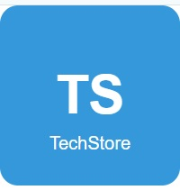
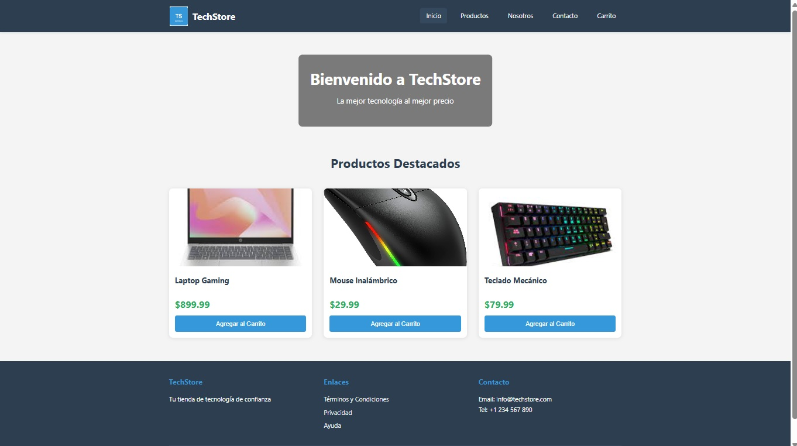
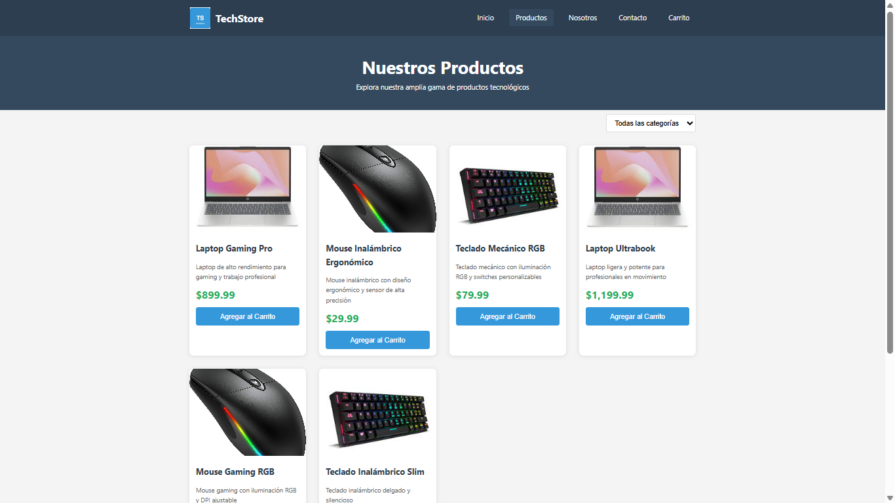
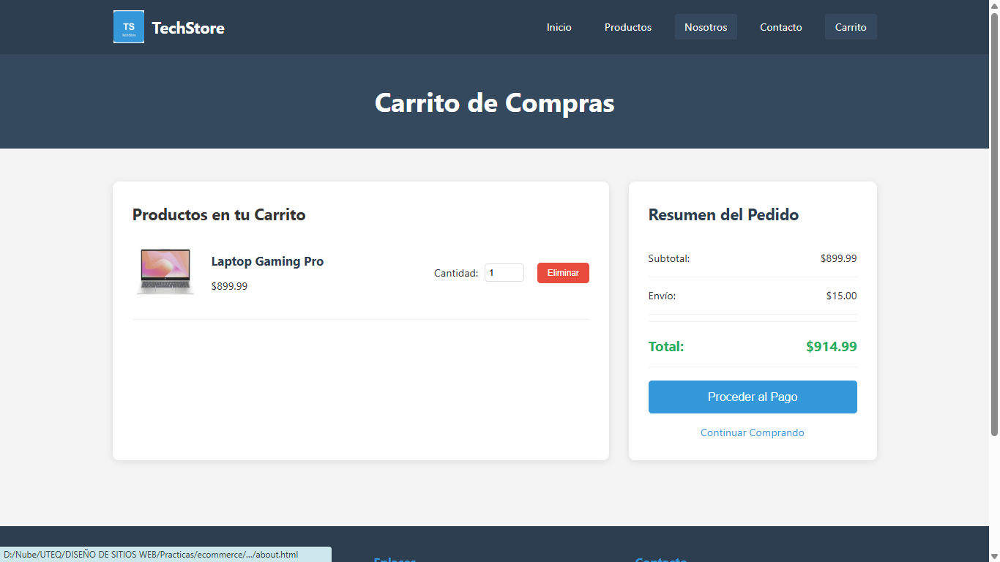

# TechStore - Ecommerce Estático



## 📋 Descripción del Proyecto

TechStore es un sitio web estático de ecommerce desarrollado como parte de la actividad de la Unidad 1 (Tema 3: Estructura de un Sitio Web) del curso de Diseño de Sitios Web. Este proyecto demuestra la aplicación de buenas prácticas de organización de archivos y estructura jerárquica de un sitio web profesional.

## 🎯 Objetivo de la Actividad

Construir la estructura completa de un sitio web estático para un ecommerce, aplicando las buenas prácticas de organización de archivos estudiadas en la Unidad 1 (Tema 3: Estructura de un Sitio Web).

El desarrollo debe realizarse **SIN base de datos**, utilizando únicamente:
- HTML
- Imágenes
- Carpetas
- Rutas relativas
- Estructura jerárquica de archivos

Esta tarea permite comprobar que el estudiante comprende cómo organizar de manera profesional un proyecto web.

## 📁 Estructura del Proyecto

```
ecommerce-static/
│── index.html
│── 404.html
│── about.html
│── contact.html
│── products.html
│── cart.html
│
├── css/
│     └── styles.css
│
├── js/
│     └── main.js
│
├── img/
│     ├── logo.png
│     ├── banner.jpg
│     └── products/
│            ├── prod1.jpg
│            ├── prod2.jpg
│            ├── prod3.jpg
│
└── pages/
       ├── terms.html
       ├── privacy.html
       └── help.html
```

## 🗺️ Mapa de Navegación

El sitio incluye las siguientes secciones:

### Páginas Principales
- **Página principal (index.html)**: Portada del sitio con productos destacados
- **Productos (products.html)**: Catálogo completo de productos
- **Nosotros (about.html)**: Información sobre la tienda
- **Contacto (contact.html)**: Formulario y datos de contacto
- **Carrito (cart.html)**: Carrito de compras

### Secciones Secundarias
- **Términos y Condiciones (pages/terms.html)**: Términos de uso
- **Privacidad (pages/privacy.html)**: Política de privacidad
- **Ayuda (pages/help.html)**: Centro de ayuda

### Páginas de Error
- **404.html**: Página de error personalizada

## 🖼️ Capturas de Pantalla

### Página Principal


La página principal incluye:
- Encabezado con logo y menú de navegación
- Banner de bienvenida
- Sección de productos destacados con tres productos principales

### Página de Productos


La página de productos muestra:
- Catálogo completo en formato de cuadrícula
- Filtro de categorías
- Información detallada de cada producto con imagen, descripción y precio

### Carrito de Compras


El carrito incluye:
- Lista de productos agregados
- Resumen del pedido con subtotal, envío y total
- Opciones para continuar comprando o proceder al pago

## 🏗️ Estructura Visual de un Sitio Web

Este proyecto implementa una serie de secciones comunes que conforman la estructura visual general de un sitio web:

### 1. Encabezado (Header)

Se ubica en la parte superior de la ventana del navegador y generalmente se extiende a lo ancho de la página. Por lo general, permanece constante en todo el sitio web. Incluye varios elementos típicos:

- **Logotipo**: Normalmente situado a la izquierda, aunque también puede aparecer en el centro o a la derecha. Representa gráficamente la marca del sitio y suele estar vinculado a la página principal, por lo que al hacer clic en él se regresa al inicio de la navegación.

- **Menús de navegación y de cortesía**: Permiten acceder rápidamente a diferentes secciones del sitio.
  - **El menú de navegación**: Presenta las áreas principales de la página mediante botones, enlaces o pestañas. Aunque no es obligatorio, muchas veces se integra dentro del encabezado. Es común que tenga formato horizontal, aunque también puede ser vertical o desplegable (como el menú "hamburguesa" en dispositivos móviles).

### 2. Contenido Principal (Main Content)

Es el cuerpo central de la página, donde se encuentra la información específica y única de cada sección del sitio. Dentro de este apartado pueden encontrarse elementos comunes como:

- **Migas de pan (Breadcrumbs)**: Generalmente aparecen en la parte superior del contenido principal y ayudan al usuario a saber en qué parte del sitio se encuentra, siguiendo una jerarquía de navegación.

- **Imagen destacada (Hero Image)**: Se trata de un banner de gran tamaño ubicado en la parte superior del contenido, habitual en portadas o páginas de aterrizaje, con un diseño llamativo que puede incluir un carrusel de imágenes.

### 3. Barra Lateral (Sidebar)

Ubicada generalmente a la derecha del contenido principal, aunque también puede estar a la izquierda o en ambos lados. Proporciona información complementaria al contenido central, como menús locales o contextuales. En las páginas de inicio no es común encontrar barras laterales.

### 4. Pie de Página (Footer)

Se encuentra al final de la página, justo después del contenido principal. Suele incluir créditos, información de contacto o un menú adicional con enlaces importantes o frecuentes.

### 5. Elementos Flotantes

Son componentes que pueden aparecer de forma temporal en la página para ofrecer o solicitar información. Algunos de ellos son:

- **Ventanas emergentes (Popups)**: Aparecen automáticamente, generalmente en el centro de la pantalla, y brindan mensajes de interés al usuario. Suelen activarse después de cierto tiempo y se utilizan en marketing digital, por ejemplo, para obtener correos electrónicos a cambio de contenido gratuito. Son percibidas como elementos intrusivos.

- **Barra promocional (Promo Bar)**: Se sitúa en la parte superior (por encima del encabezado) o en la parte inferior (debajo del pie de página) y presenta ofertas o mensajes promocionales.

- **Barra de notificación (Notification Bar)**: A diferencia de la barra promocional, esta comunica eventos relacionados con el sitio o el usuario.

## 🚀 Características del Sitio

- ✅ Diseño responsive y moderno
- ✅ Navegación intuitiva entre secciones
- ✅ Estructura de archivos organizada y profesional
- ✅ Uso de rutas relativas para portabilidad
- ✅ Página de error 404 personalizada
- ✅ Carrito de compras funcional (frontend)
- ✅ Secciones de información legal y ayuda

## 🛠️ Tecnologías Utilizadas

- **HTML5**: Estructura semántica del sitio
- **CSS3**: Estilos y diseño responsive
- **JavaScript**: Funcionalidad interactiva del carrito y navegación

## 📝 Archivo index.html

El archivo principal contiene:

- ✅ Encabezado con logo
- ✅ Menú de navegación
- ✅ Imagen principal (banner)
- ✅ Introducción breve al sitio
- ✅ Sección de productos destacados
- ✅ Pie de página con enlaces e información de contacto

## 👤 Autor

**Cristian Zambrano**

- Email: cristian_uteq@hotmail.com

## 📄 Licencia

Este proyecto fue desarrollado como parte de una actividad académica del curso de Diseño de Sitios Web.

---

**TechStore** - Tu tienda de tecnología de confianza

